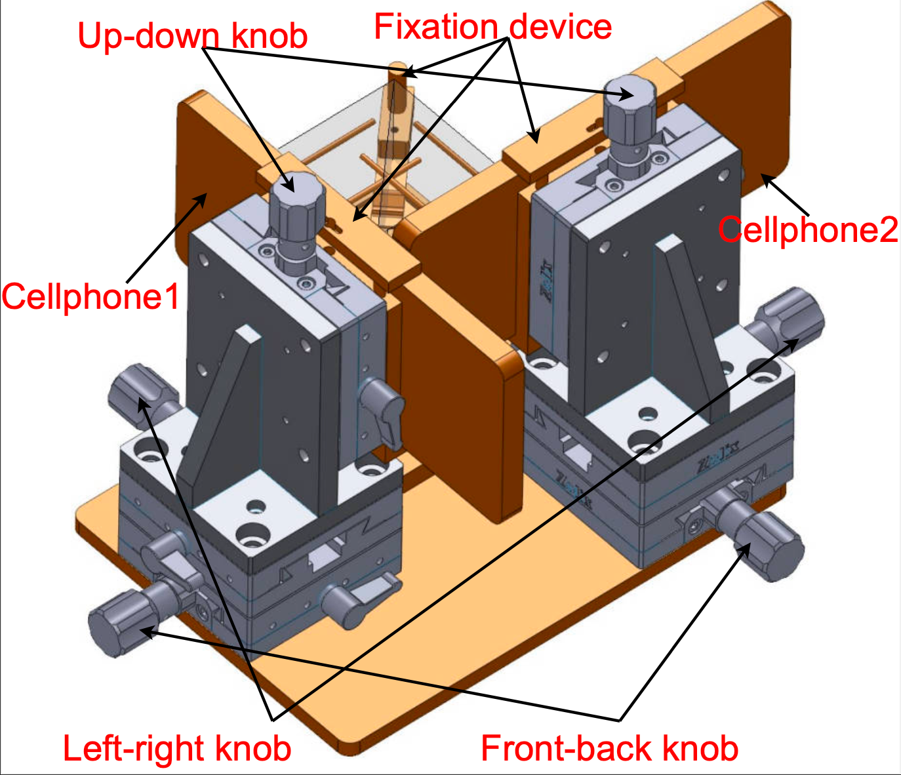
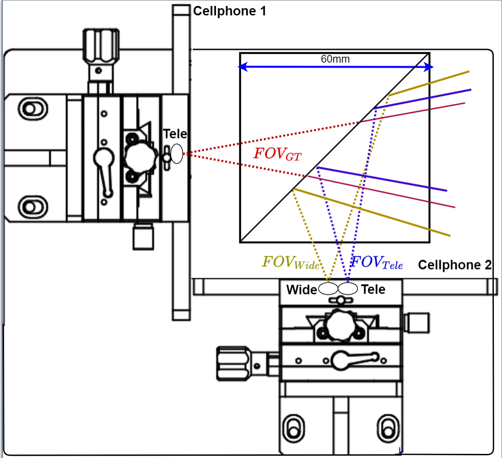
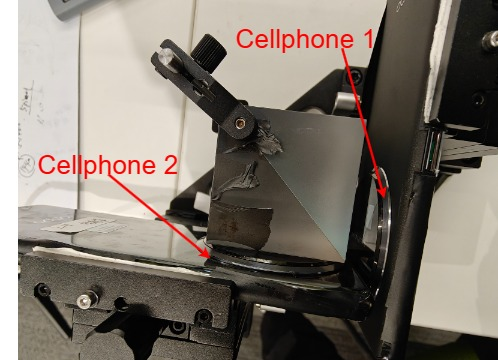
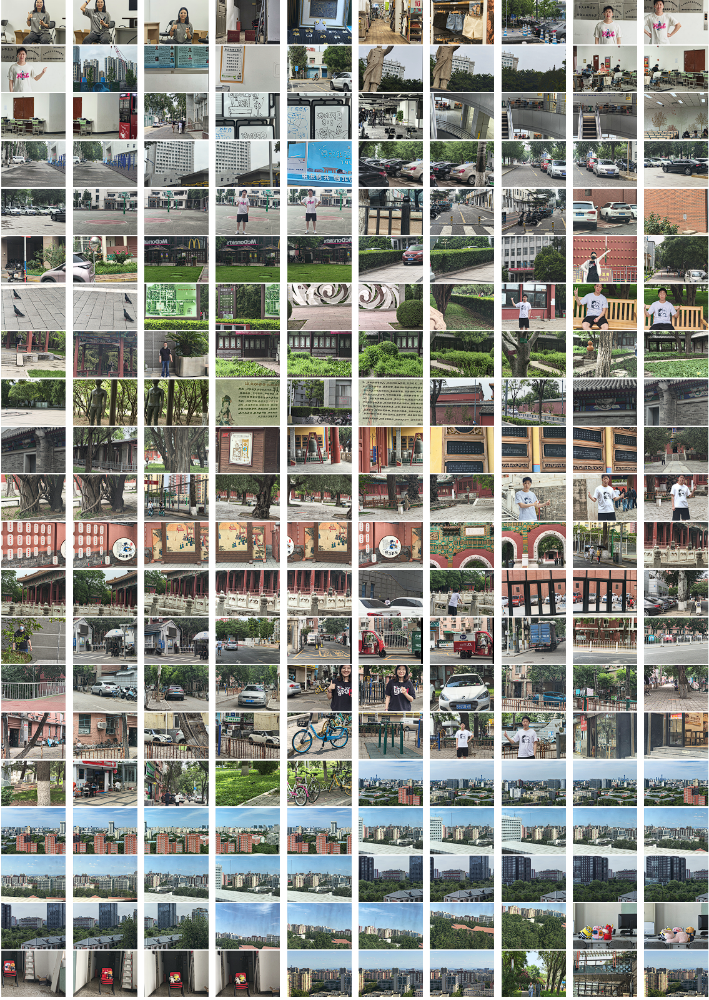
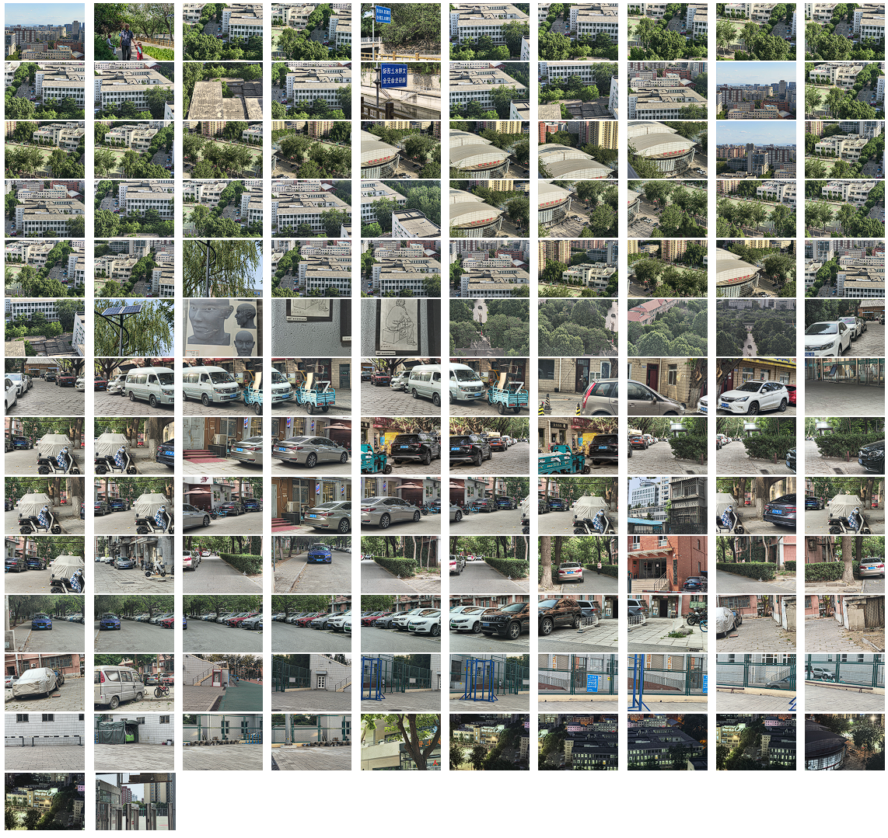

# ReWiTe: Realistic Wide-angle and Telephoto Dual Camera Fusion Dataset via Beam Splitter Camera Rig
## Summary
We collected 347 sets of images. Each set includes the input wide-angle image, the input telephoto image, and the ground-truth image. The input pairs of wide-angle and telephoto images are taken with the wide-angle and telephoto dual-camera of an OPPO Find X6. The ground-truth images are taken with the telephoto camera of another OPPO Find X6. Our device, shown in Fig.1,2,3, ensures that the ground-truth images and the input wide-angle images share the same optical path. 

Please contact us if there is any questions: pcl@bupt.edu.cn or  dongxuan8811@bupt.edu.cn.


<div align="center">
Figure 1. 3D structure of our hardware device. The six knobs are designed to perform the calibration. We use the cellphone of OPPO FIND X6.
</div>


<div align="center">
Figure 2: Design diagram of our hardware and the spectral
division system. It consists of two cellphones with wide-angle(W) and telephoto(T)
dual cameras, a beamsplitter to divide the optical path into a
50%-50% split, and the fixation device. We perform calibration
to let the T camera of cellphone 1 share the same optical path
of the W camera of cellphone 2. ‘Wide’ is short for the wide-angle camera, and ‘Tele’ is short for the telephoto camera.
</div>


<div align="center">
Figure 3: The real photos of our hardware. We use two OPPO
Find X6 cellphones to build the hardware.
</div>

## Dataset Structure
- ReWiTe
  - train
    - wide_1x (Input wide-angle)
    - wide_2x
    - wide_4x
    - tele (Reference telephoto)
    - gt
  - test
    - wide_1x (Input wide-angle)
    - wide_2x
    - wide_4x
    - tele (Reference telephoto)
    - gt
  - validation
    - wide_1x (Input wide-angle)
    - wide_2x
    - wide_4x
    - tele (Reference telephoto)
    - gt

We provide the wide-angle input with the original resolution in wide_1x. Existing super-resolution methods usually assume the resolution of the wide-angle input is smaller than that of the ground-truth image. So, we downsample the original wide-angle input by bicubic interpolation to generate the wide-angle input with smaller resolution in wide_2x, and wide_4x.

# Data
You can download our dataset from [here](https://drive.google.com/file/d/1058Y97Sw1uOgftvTF4MmfcqLslYsED3_/view?usp=sharing).



<div align="center">
Figure 4. The overview of our dataset. We only show the input wide-angle images here for simplification. 
</div>

## References

```
@misc{rewite,
      title={ReWiTe: Realistic Wide-angle and Telephoto Dual Camera Fusion Dataset via Beam Splitter Camera Rig}, 
      author={Chunli Peng and Xuan Dong and Tiantian Cao and Zhengqing Li and Kun Dong and Weixin Li},
      year={2024},
      eprint={2404.10584},
      archivePrefix={arXiv},
      primaryClass={cs.CV}
}
```

## Acknowledgments
We are very grateful to OPPO for their professional guidance and equipment support.